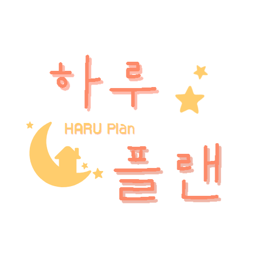

# 🌕 하루 플랜

### 🔗링크
https://jjiyunkim.github.io/Algorithm_project/

### ✈️ 소개
쏟아지는 과제로 힘들어하는 대학생들을 위해 어떤 과제를 먼저해야할지 우선순위를 알려주는 웹 프로그램
    
### 🛠 기능 요약
step 1. 과제 목록 입력
step 2. 공부 할 시간 입력
step 3. 오늘의 과제장을 보게 되면 knapsack알고리즘을 통해 걸리는 시간과 전공여부에 따라 우선순위 제공

### ⏰ 개발 기간
2022년 11월 1일 ~ 2021년 11월 30일  

### 👩‍💻 멤버 구성
- 김회민
- 김지윤
- 이재림
- 임혜림

### 📌 기술
- HTML, CSS, JavaScript 
